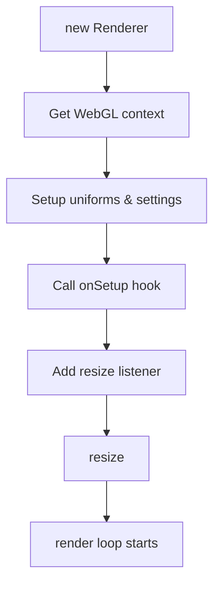
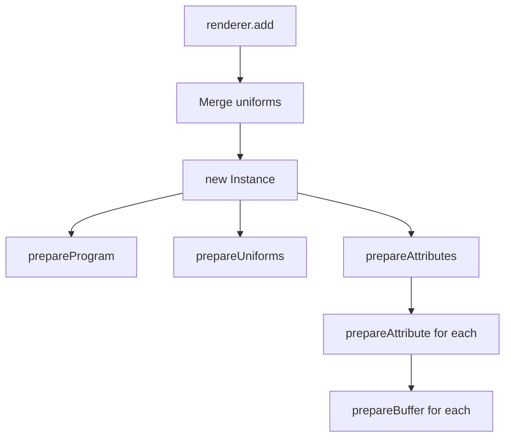
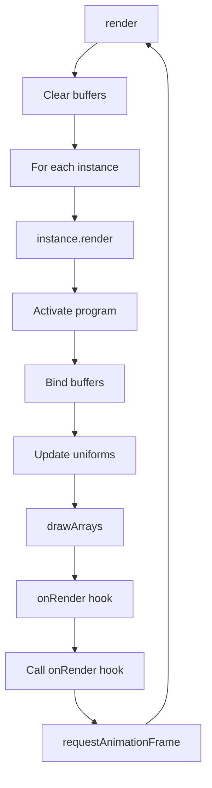

## Renderer Methods

The Renderer class provides methods for managing instances and controlling the render loop.

### Instance Management

#### add()

Adds a new instance to the renderer.

```typescript
add(key: string, settings: InstanceProps): Instance
```

<ParamField path="key" type="string" required>
  Unique identifier for the instance.
</ParamField>

<ParamField path="settings" type="InstanceProps" required>
  Instance configuration including shaders, geometry, and uniforms.
</ParamField>

**Returns:** The created `Instance` object.

```javascript
const particles = renderer.add('particles', {
  vertex: vertexShader,
  fragment: fragmentShader,
  uniforms: {
    uTime: { type: 'float', value: 0 }
  }
});
```

#### remove()

Removes and destroys an instance.

```typescript
remove(key: string): void
```

<ParamField path="key" type="string" required>
  Identifier of the instance to remove.
</ParamField>

```javascript
renderer.remove('particles');
```

### Lifecycle Methods

#### resize()

Updates canvas dimensions and projection matrices.

```typescript
resize(): void
```

Automatically called on window resize events and initialization.

```javascript
// Manually trigger resize
renderer.resize();
```

#### render()

Renders all instances for one frame.

```typescript
render(): void
```

Automatically starts the render loop on initialization.

#### toggle()

Controls the render loop state.

```typescript
toggle(shouldRender?: boolean): void
```

<ParamField path="shouldRender" type="boolean" optional>
  `true` to start, `false` to stop, or omit to toggle current state.
</ParamField>

```javascript
renderer.toggle(false); // Pause
renderer.toggle(true);  // Resume
renderer.toggle();      // Toggle
```

#### destroy()

Destroys renderer and all instances.

```typescript
destroy(): void
```

```javascript
renderer.destroy();
```

## Instance Methods

The Instance class provides methods for shader compilation, buffer management, and rendering.

### Shader Management

#### compileShader()

Compiles a GLSL shader.

```typescript
compileShader(type: number, source: string): WebGLShader
```

<ParamField path="type" type="number" required>
  Shader type: `35633` (VERTEX_SHADER) or `35632` (FRAGMENT_SHADER)
</ParamField>

<ParamField path="source" type="string" required>
  GLSL shader source code.
</ParamField>

**Returns:** Compiled `WebGLShader` object.

Internal method called by `prepareProgram()`.

#### prepareProgram()

Creates and links the shader program.

```typescript
prepareProgram(): void
```

Automatically called in the constructor. Links vertex and fragment shaders into a program.

### Uniform Management

#### prepareUniforms()

Retrieves uniform locations from the shader program.

```typescript
prepareUniforms(): void
```

Automatically called in the constructor. Assigns `location` property to each uniform.

### Attribute & Buffer Management

#### prepareAttributes()

Creates buffer attributes for all geometry data.

```typescript
prepareAttributes(): void
```

**Behavior:**
- Adds `aPosition` attribute for vertices
- Adds `aNormal` attribute if normals are defined
- Processes custom attributes
- Calls `prepareAttribute()` for each

Automatically called in the constructor.

#### prepareAttribute()

Prepares a single attribute with data.

```typescript
prepareAttribute(attribute: AttributeProps): void
```

<ParamField path="attribute" type="AttributeProps" required>
  Attribute with name, size, and optional data function.
</ParamField>

**Behavior:**
- Creates `Float32Array` for attribute data
- Applies geometry multiplier for instanced rendering
- Processes modifier functions
- Calls `prepareBuffer()` to create WebGL buffer

#### prepareBuffer()

Creates a WebGL buffer for an attribute.

```typescript
prepareBuffer(attribute: AttributeProps): void
```

<ParamField path="attribute" type="AttributeProps" required>
  Attribute with prepared buffer data.
</ParamField>

**Behavior:**
- Creates and binds WebGL buffer
- Uploads data with STATIC_DRAW
- Configures attribute pointer
- Stores buffer reference

### Rendering

#### render()

Renders the instance.

```typescript
render(renderUniforms: object): void
```

<ParamField path="renderUniforms" type="object" required>
  Shared uniforms from the renderer (projection/view/model matrices).
</ParamField>

**Behavior:**
- Activates shader program
- Binds vertex buffers
- Updates all uniforms
- Draws geometry with `gl.drawArrays()`
- Calls `onRender` callback if defined

Called automatically by the Renderer each frame.

#### destroy()

Cleans up WebGL resources.

```typescript
destroy(): void
```

**Behavior:**
- Deletes all vertex buffers
- Deletes shader program
- Nulls WebGL context reference

```javascript
instance.destroy();
```

## Method Call Flow

### Initialization Flow



### Adding Instance Flow



### Render Loop Flow



## Common Patterns

### Updating Uniforms Each Frame

```javascript
const instance = renderer.add('particles', {
  vertex: vertexShader,
  fragment: fragmentShader,
  uniforms: {
    uTime: { type: 'float', value: 0 }
  }
});

instance.onRender = (instance) => {
  instance.uniforms.uTime.value += 0.01;
};
```

### Custom Attribute Modifiers

```javascript
renderer.add('particles', {
  vertex: vertexShader,
  fragment: fragmentShader,
  attributes: [
    {
      name: 'aOffset',
      size: 3,
      data: (i, total) => [Math.random(), Math.random(), Math.random()]
    }
  ],
  modifiers: {
    aOffset: (data, vertexIndex, componentIndex, instance) => {
      // Custom logic to modify attribute value
      return data[componentIndex] * 2.0;
    }
  },
  multiplier: 1000
});
```

### Performance: Pausing Rendering

```javascript
// Pause when tab is hidden
document.addEventListener('visibilitychange', () => {
  renderer.toggle(!document.hidden);
});
```

### Cleanup

```javascript
// Remove single instance
renderer.remove('particles');

// Destroy everything
renderer.destroy();
```